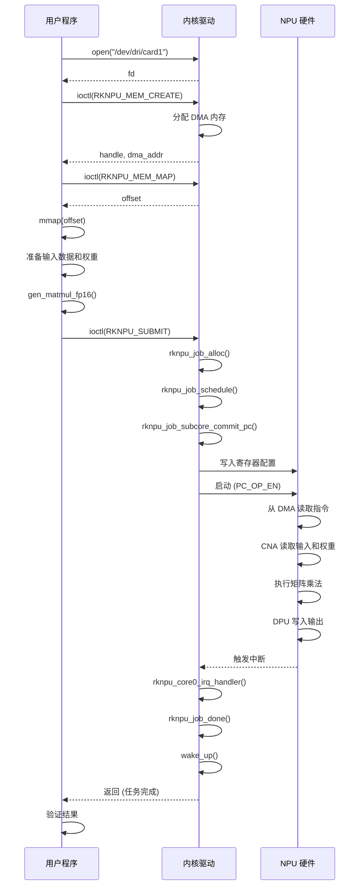

# RK3588 NPU 矩阵运算完整分析

本文档详细解释了如何让 RK3588 的 NPU 进行矩阵运算，包括完整的调用关系路径和驱动实现原理。

---

## 📊 调用关系路径

### 用户态程序流程 (Rust)

```
main.rs (rknpu2/src/)
  └─> run_matmul_test()  (matmul.rs)
       │
       ├─> NpuDevice::open()  (interface.rs)
       │    └─> 打开 /dev/dri/card1 设备
       │    └─> DRM_IOCTL_VERSION ioctl (查询驱动版本)
       │
       ├─> npu.mem_allocate()  (interface.rs)
       │    └─> DRM_IOCTL_RKNPU_MEM_CREATE ioctl
       │    └─> DRM_IOCTL_RKNPU_MEM_MAP ioctl
       │    └─> mmap() 映射内存到用户空间
       │
       ├─> npu.reset()  (interface.rs)
       │    └─> DRM_IOCTL_RKNPU_ACTION ioctl (RKNPU_ACT_RESET)
       │
       ├─> gen_matmul_fp16()  (matmul.rs)
       │    │
       │    ├─> 填充 NpuCnaDesc (卷积加速器描述符)
       │    ├─> 填充 NpuCoreDesc (核心描述符)
       │    ├─> 填充 NpuDpuDesc (数据处理单元描述符)
       │    │
       │    └─> gen_matmul_task()
       │         └─> 生成 112 个 NPU 操作指令 (ops[0..111])
       │              - 配置 CNA 寄存器 (卷积操作)
       │              - 配置 CORE 寄存器 (计算核心)
       │              - 配置 DPU 寄存器 (数据处理和输出)
       │
       ├─> 准备输入数据 (Matrix A) 和权重 (Matrix B)
       │    ├─> 转换为 FP16 格式
       │    └─> 按照特定内存布局排列 (feature_data, weight_fp16)
       │
       ├─> 填充 RknpuTask 结构
       │    ├─> regcmd_addr: NPU 寄存器命令的 DMA 地址
       │    ├─> regcfg_amount: 寄存器配置数量
       │    ├─> int_mask: 中断掩码
       │    └─> enable_mask: 使能掩码
       │
       ├─> 填充 RknpuSubmit 结构
       │    ├─> flags: RKNPU_JOB_PC | RKNPU_JOB_BLOCK | RKNPU_JOB_PINGPONG
       │    ├─> task_obj_addr: Task 对象地址
       │    ├─> core_mask: 使用哪个核心 (core 0/1/2)
       │    └─> timeout: 超时时间
       │
       └─> npu.submit(&mut submit)  (interface.rs)
            └─> DRM_IOCTL_RKNPU_SUBMIT ioctl
                 └─> 进入内核驱动 ⬇
```

---

## 🔧 驱动实现原理 (./rknpu)

### 1. IOCTL 入口处理

```c
// rknpu_drv.c
DRM_IOCTL_RKNPU_SUBMIT
  └─> rknpu_submit_ioctl()
       │
       ├─> 验证参数 (task_number, core_mask, timeout)
       ├─> rknpu_power_get() - 开启 NPU 电源
       │
       └─> rknpu_job_commit() 
```

### 2. 任务提交流程 (rknpu_job.c)

```c
rknpu_job_commit()
  │
  ├─> rknpu_job_alloc() - 分配任务结构
  │    └─> 初始化 job->use_core_num (使用几个核心)
  │    └─> atomic_set(&job->run_count, use_core_num)
  │    └─> atomic_set(&job->interrupt_count, use_core_num)
  │
  ├─> rknpu_job_schedule() - 调度任务到核心
  │    │
  │    ├─> 根据 core_mask 选择核心 (0/1/2)
  │    ├─> 将任务添加到 todo_list
  │    │
  │    └─> rknpu_job_next() - 执行下一个任务
  │         │
  │         └─> rknpu_job_commit()
  │              └─> rknpu_job_subcore_commit()
  │                   └─> rknpu_job_subcore_commit_pc() ⬇
```

### 3. PC 模式任务提交 (程序计数器模式)

```c
rknpu_job_subcore_commit_pc(job, core_index)
  │
  ├─> 从 task_obj 获取任务基地址
  │    task_base = task_obj->kv_addr
  │
  ├─> 获取第一个和最后一个任务
  │    first_task = &task_base[task_start]
  │    last_task = &task_base[task_end]
  │
  ├─> 写入 NPU 寄存器:
  │    │
  │    ├─> RKNPU_OFFSET_PC_DATA_ADDR
  │    │    └─> first_task->regcmd_addr (寄存器命令 DMA 地址)
  │    │
  │    ├─> RKNPU_OFFSET_PC_DATA_AMOUNT
  │    │    └─> regcfg_amount (寄存器配置数量)
  │    │
  │    ├─> RKNPU_OFFSET_INT_MASK
  │    │    └─> last_task->int_mask (设置中断掩码)
  │    │
  │    ├─> RKNPU_OFFSET_INT_CLEAR
  │    │    └─> 清除中断
  │    │
  │    ├─> RKNPU_OFFSET_PC_TASK_CONTROL
  │    │    └─> (0x6 | pingpong) << bits | task_number
  │    │
  │    ├─> RKNPU_OFFSET_PC_DMA_BASE_ADDR
  │    │    └─> task_base_addr
  │    │
  │    └─> RKNPU_OFFSET_PC_OP_EN
  │         └─> 写入 0x1 然后 0x0 启动 NPU
  │
  └─> NPU 开始执行 ⬇
```

### 4. NPU 硬件执行

```
NPU 硬件收到启动信号后:
  │
  ├─> PC (Program Counter) 单元从 DMA 读取寄存器命令
  │    └─> 从 regcmd_addr 读取 112 个 u64 操作指令
  │
  ├─> 解析操作指令并配置各个单元:
  │    │
  │    ├─> CNA (Convolution Neural Accelerator)
  │    │    ├─> 从 feature_base_addr 读取输入矩阵 (Matrix A)
  │    │    ├─> 从 decompress_addr0 读取权重矩阵 (Matrix B)
  │    │    ├─> 配置卷积参数 (实际用于矩阵乘法)
  │    │    │    - datain_width, datain_height, datain_channel
  │    │    │    - weight_width, weight_height, weight_kernels
  │    │    │    - conv_mode = DirectConvolution
  │    │    │    - precision = Float16
  │    │    └─> 执行矩阵乘法运算
  │    │
  │    ├─> CORE (计算核心)
  │    │    ├─> 接收 CNA 的输出
  │    │    ├─> 配置输出维度和精度
  │    │    └─> 传递给 DPU
  │    │
  │    └─> DPU (Data Processing Unit)
  │         ├─> 接收 CORE 的输出
  │         ├─> 配置输出格式 (FP32 或 FP16)
  │         ├─> 禁用所有后处理 (BS, BN, EW 等)
  │         ├─> 将结果写入 dst_base_addr (输出内存)
  │         └─> 完成后触发中断
```

### 5. 中断处理

```c
硬件完成 → 触发 NPU 中断 → Linux 中断系统
  │
  └─> rknpu_core0_irq_handler() (rknpu_job.c)
       │
       ├─> 读取 RKNPU_OFFSET_INT_STATUS 寄存器
       ├─> 验证中断状态与 int_mask 匹配
       ├─> REG_WRITE(RKNPU_INT_CLEAR) 清除中断
       │
       └─> rknpu_job_done(job, 0, core_index)
            │
            ├─> 计算硬件运行时间
            ├─> atomic_dec(&job->interrupt_count)
            ├─> 如果所有核心都完成:
            │    ├─> job->flags |= RKNPU_JOB_DONE
            │    ├─> dma_fence_signal() (如果使用 fence)
            │    └─> wake_up(&job_done_wq) 唤醒等待线程
            │
            └─> rknpu_job_next() 执行下一个任务
```

### 6. 用户态等待完成

```c
用户态 wait_event_timeout() 等待
  │
  └─> 被中断处理的 wake_up() 唤醒
       │
       ├─> 检查 job->flags & RKNPU_JOB_DONE
       ├─> 读取输出内存中的结果
       └─> 验证计算结果
```

---

## 🎯 关键技术点

### 1. PC 模式 (Program Counter Mode)

- **不是传统的逐个寄存器写入**
- 而是预先准备好所有寄存器配置 (112个操作指令)
- 通过 DMA 批量传输给 NPU
- NPU 按照指令序列自动配置和执行

**优势：**
- 减少 CPU 参与
- 提高吞吐量
- 支持批量任务

### 2. 矩阵乘法映射到卷积

```rust
// 矩阵乘法 C = A * B
// A: M x K (4 x 36)
// B: K x N (36 x 16) → 转置为 N x K (16 x 36)
// C: M x N (4 x 16)

// 映射到卷积操作:
datain: M x K (特征图)       → Matrix A
weight: N x K (卷积核)       → Matrix B (转置)
output: M x N (输出特征图)   → Matrix C
```

**原理：**
- 卷积本质上是局部矩阵乘法
- 通过配置 1x1 卷积核实现全连接
- 利用 NPU 的卷积加速器进行通用矩阵运算

### 3. 内存布局

```rust
// 输入数据使用特殊布局 feature_data(c, h, w, c2, c_val, h_val, w_val)
// 权重使用特殊布局 weight_fp16(c, k, c_val)
```

**布局函数：**

```rust
pub fn feature_data(_c: i32, h: i32, w: i32, c2: i32, 
                    c_val: i32, h_val: i32, w_val: i32) -> i32 {
    let plane = (c_val - 1) / c2;
    let src = plane * h * w * c2;
    let offset = (c_val - 1) % c2;
    let pos = src + c2 * ((h_val - 1) * w + (w_val - 1)) + offset;
    pos
}

pub fn weight_fp16(c: i32, k: i32, c_val: i32) -> i32 {
    let kpg = (k - 1) / 16;
    let cpg = (c_val - 1) / 32;
    let mut dst = (cpg * 32) * 16 + kpg * 16 * c;
    dst = dst + ((c_val - 1) % 32) + (((k - 1) % 16) * 32);
    dst
}
```

**原因：**
- 适配 NPU 的 CBUF (Circular Buffer) 访问模式
- 优化内存访问效率
- 支持硬件的并行处理

### 4. 中断机制

```c
int_mask = 0x300  // 等待 DPU 完成中断
// bit 8-9: DPU 完成标志
```

**中断标志：**
- `0x3`: CNA 完成
- `0xc`: 未使用
- `0x30`: 未使用
- `0xc0`: 未使用
- `0x300`: **DPU 完成** (主要使用)
- `0xc00`: 未使用

### 5. NPU 寄存器操作指令格式

每个操作指令是一个 64 位的值：

```rust
pub const fn npuop(op: u16, value: u32, reg: u16) -> u64 {
    ((op as u64 & 0xffff) << 48) |      // 操作类型 (16 bits)
    ((value as u64 & 0xffffffff) << 16) | // 寄存器值 (32 bits)
    (reg as u64 & 0xffff)                 // 寄存器地址 (16 bits)
}
```

**操作类型：**
- `OP_REG_CNA (0x0201)`: 配置 CNA 寄存器
- `OP_REG_CORE (0x0801)`: 配置 CORE 寄存器
- `OP_REG_DPU (0x1001)`: 配置 DPU 寄存器
- `OP_ENABLE (0x8001)`: 使能指定单元

---

## 📁 文件职责总结

### 用户态 (Rust)

| 文件 | 职责 |
|------|------|
| `rknpu2/src/main.rs` | 测试程序入口 |
| `rknpu2/src/matmul.rs` | 矩阵乘法测试逻辑，准备测试数据 |
| `rk3588-rs/src/interface.rs` | NPU 设备接口 (open, mem_allocate, submit) |
| `rk3588-rs/src/matmul.rs` | 生成矩阵乘法任务指令，核心算法 |
| `rk3588-rs/src/ioctl.rs` | IOCTL 定义和结构体，内核接口 |
| `rk3588-rs/src/hw.rs` | NPU 寄存器定义和操作宏 |
| `rk3588-rs/src/cna.rs` | CNA (卷积加速器) 描述符 |
| `rk3588-rs/src/dpu.rs` | DPU (数据处理单元) 描述符 |
| `rknpu2-sys/src/lib.rs` | RKNN API 的 FFI 绑定 |

### 内核态 (C)

| 文件 | 职责 |
|------|------|
| `rknpu/rknpu_drv.c` | 驱动主文件，设备初始化，电源管理 |
| `rknpu/rknpu_job.c` | 任务调度、提交、中断处理，核心逻辑 |
| `rknpu/rknpu_gem.c` | GEM 内存管理 (DRM 框架) |
| `rknpu/rknpu_mem.c` | DMA 堆内存管理 |
| `rknpu/rknpu_fence.c` | DMA Fence 同步机制 |
| `rknpu/rknpu_reset.c` | NPU 软复位功能 |
| `rknpu/rknpu_iommu.c` | IOMMU 配置 |
| `rknpu/include/rknpu_ioctl.h` | 用户态-内核态接口定义 |
| `rknpu/include/rknpu_drv.h` | 驱动内部数据结构 |

---

## 🔍 详细代码流程

### gen_matmul_fp16() 函数详解

```rust
pub fn gen_matmul_fp16(params: &mut MatmulParams) -> Result<(), i32> {
    // 1. 初始化描述符
    let mut cna_desc = NpuCnaDesc::default();
    let mut core_desc = NpuCoreDesc::default();
    let mut dpu_desc = NpuDpuDesc::default();

    // 2. 配置 CNA (卷积加速器)
    cna_desc.conv_mode = ConvMode::DirectConvolution as u8;
    cna_desc.in_precision = Precision::Float16 as u8;
    cna_desc.proc_precision = Precision::Float16 as u8;
    
    // 输入维度: M x K
    cna_desc.datain_width = 1;
    cna_desc.datain_height = params.m;
    cna_desc.datain_channel = params.k;
    
    // 权重维度: N x K (卷积核数量)
    cna_desc.weight_width = 1;
    cna_desc.weight_height = 1;
    cna_desc.weight_kernels = params.n;
    
    // 计算权重大小
    cna_desc.weight_bytes_per_kernel = 
        1 * 1 * params.k as u32 * 2;  // sizeof(fp16) = 2
    
    // 3. 分配 CBUF (Circular Buffer)
    let fd_bytes = 1 * params.m as usize * params.k as usize * 2;
    let mut fd_banks = fd_bytes / NPU_CBUF_BANK_SIZE;
    if (fd_bytes % NPU_CBUF_BANK_SIZE) != 0 {
        fd_banks += 1;
    }
    
    // 检查是否超出 CBUF 容量
    if fd_banks > NPU_CBUF_BANKS - 1 {
        return Err(-1);  // 输入数据太大
    }
    
    let weight_banks = NPU_CBUF_BANKS - fd_banks;
    cna_desc.data_bank = fd_banks as u8;
    cna_desc.weight_bank = weight_banks as u8;
    
    // 4. 配置 DMA 地址
    cna_desc.feature_base_addr = params.input_dma;
    cna_desc.decompress_addr0 = params.weights_dma;
    
    // 5. 配置 CORE
    core_desc.proc_precision = Precision::Float16 as u8;
    core_desc.dataout_height = params.m - 1;
    core_desc.dataout_width = 0;  // 1 - 1
    core_desc.dataout_channel = params.n - 1;
    
    // 6. 配置 DPU (输出)
    dpu_desc.dst_base_addr = params.output_dma;
    dpu_desc.out_precision = if params.fp32tofp16 == 0 {
        Precision::Float32 as u8
    } else {
        Precision::Float16 as u8
    };
    
    // 禁用所有后处理
    dpu_desc.bs_bypass = 1;
    dpu_desc.bn_bypass = 1;
    dpu_desc.ew_bypass = 1;
    
    // 7. 生成 112 个操作指令
    unsafe {
        let ops_slice = slice::from_raw_parts_mut(params.tasks, 112);
        gen_matmul_task(ops_slice, &cna_desc, &core_desc, &dpu_desc);
    }
    
    Ok(())
}
```

### gen_matmul_task() 指令生成

```rust
fn gen_matmul_task(
    ops: &mut [u64],
    cna_desc: &NpuCnaDesc,
    core_desc: &NpuCoreDesc,
    dpu_desc: &NpuDpuDesc,
) {
    // 操作 0: DPU 指针
    ops[0] = npuop(OP_REG_DPU, 0xE, DPU_S_POINTER);
    
    // 操作 1-48: 配置 CNA
    ops[1] = npuop(OP_REG_CNA, 
        ((cna_desc.proc_precision as u32 & 0x7) << 7) |
        ((cna_desc.in_precision as u32 & 0x7) << 4) |
        (cna_desc.conv_mode as u32 & 0xf),
        CNA_CONV_CON1);
    
    ops[21] = npuop(OP_REG_CNA, 
        cna_desc.feature_base_addr,
        CNA_FEATURE_DATA_ADDR);
    
    ops[30] = npuop(OP_REG_CNA, 
        cna_desc.decompress_addr0, 
        CNA_DCOMP_ADDR0);
    
    // 操作 49-53: 配置 CORE
    ops[49] = npuop(OP_REG_CORE, 
        ((core_desc.proc_precision as u32 & 0x7) << 8) |
        (core_desc.qd_en as u32 & 0x1),
        CORE_MISC_CFG);
    
    // 操作 54-103: 配置 DPU
    ops[57] = npuop(OP_REG_DPU, 
        dpu_desc.dst_base_addr, 
        DPU_DST_BASE_ADD);
    
    ops[80] = npuop(OP_REG_DPU, 
        ((dpu_desc.fp32tofp16_en as u32 & 0x1) << 16) |
        (dpu_desc.out_cvt_scale as u32 & 0xFFFF),
        DPU_OUT_CVT_SCALE);
    
    // 操作 104-107: 控制指令
    ops[104] = npuop(OP_NONE, 0x0, 0x0);
    ops[105] = npuop(OP_REG_PC, 0x0, PC_REGISTER_AMOUNTS);
    ops[106] = npuop(OP_40, 0x0, 0x0);
    
    // 操作 107: 使能指令 (启动执行)
    ops[107] = npuop(
        OP_ENABLE,
        (PC_ENABLE_DPU | PC_ENABLE_CNA | PC_ENABLE) as u32,
        PC_OPERATION_ENABLE,
    );
}
```

---

## 🚀 执行流程时序图



---

## 💡 常见问题

### Q1: 为什么矩阵维度需要对齐？

A: NPU 的 CBUF 和计算单元以固定大小的块处理数据：
- FP16: 32 个元素一组
- INT8: 64 个元素一组
- 需要将 K 维度对齐到 64 (例如 36 → 64)

### Q2: 如何支持更大的矩阵？

A: 当前实现有 CBUF 限制，支持大矩阵需要：
1. 分块计算 (Tiling)
2. 生成多个任务
3. 使用外部内存而非 CBUF

### Q3: 可以同时使用多个核心吗？

A: 可以！RK3588 有 3 个 NPU 核心：
```rust
submit.core_mask = RKNPU_CORE0_MASK | RKNPU_CORE1_MASK | RKNPU_CORE2_MASK;
```
驱动会自动调度任务到各个核心。

### Q4: INT8 量化如何使用？

A: 使用 `gen_matmul_int8()` 函数：
```rust
let mut params = MatmulParams {
    m: 4,
    k: 64,
    n: 16,
    input_dma: input_mem.dma_addr() as u32,
    weights_dma: weights_mem.dma_addr() as u32,
    output_dma: output_mem.dma_addr() as u32,
    tasks: npu_regs.as_mut_ptr(),
    fp32tofp16: 0,
};

gen_matmul_int8(&mut params)?;
```

---

## 📚 参考资料

### 硬件文档
- RK3588 Technical Reference Manual (TRM)
- NPU Architecture Specification

### 相关项目
- [RKNN Toolkit2](https://github.com/rockchip-linux/rknn-toolkit2)
- [rknpu-driver](https://github.com/rockchip-linux/rknpu-driver)

### Linux DRM 框架
- [DRM Developer Guide](https://www.kernel.org/doc/html/latest/gpu/drm-internals.html)
- [GEM Memory Management](https://www.kernel.org/doc/html/latest/gpu/drm-mm.html)

---

## 📝 总结

这个项目展示了一个完整的 **用户态 → 内核态 → 硬件** 的调用链：

1. **用户态**：通过 Rust 封装的接口，使用 DRM IOCTL 与驱动通信
2. **内核态**：驱动接收任务，进行调度和管理，处理中断
3. **硬件**：NPU 使用 PC 模式批量读取配置，执行矩阵运算

**关键创新点**：
- 使用 PC 模式实现批量寄存器配置
- 将矩阵乘法映射到卷积操作
- 利用 DMA 和中断机制提高效率
- 支持多核心并行计算

这种设计模式可以应用于其他加速器驱动开发，具有很好的参考价值。

---

*文档生成时间: 2025-10-11*
*项目地址: [rknpu2-rslab](https://github.com/starry-mix-rk3588/rknpu2-rslab)*
